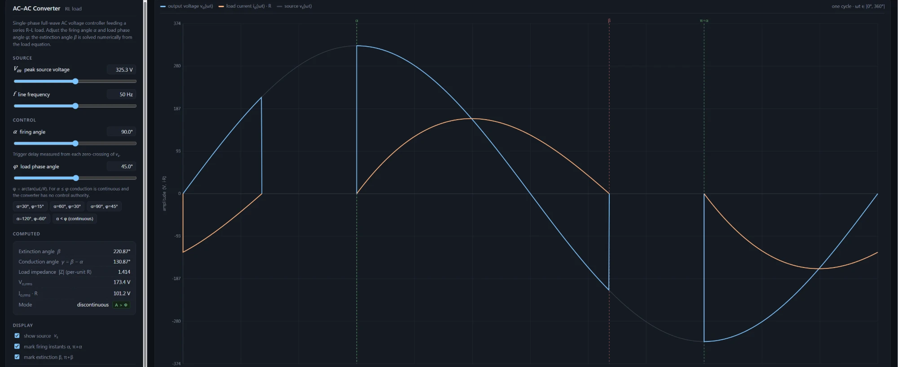

# AC-AC Converter Simulation

A single-phase full-wave AC voltage controller simulation feeding a series R-L load. Interactive web-based tool for power electronics analysis.

## Features

- **Adjustable Source Parameters**
  - Peak source voltage (Vm)
  - Line frequency (f)
- **AC Control**
  - Firing angle (alpha) with real-time waveform update
  - Load phase angle (phi) adjustment
- **Load Types** — Supports R-L load analysis
- **Computed Parameters:**
  - Extinction angle (beta)
  - Conduction angle (gamma = beta - alpha)
  - Load impedance |Z| (per-unit R)
  - Output RMS voltage (Vo,rms)
  - Load current RMS (Io,rms * R)
  - Conduction mode (continuous/discontinuous)
- **Waveform Display:**
  - Output voltage vo(wt)
  - Load current io(wt) * R
  - Source voltage vs(wt)
- **Preset Configurations** — Quick-access buttons for common firing/phase angle combinations (30/15, 60/30, 90/45, 120/60)

## How to Use

1. Open `AC-AC Converter Simulation.html` in a web browser
2. Adjust source voltage and frequency sliders
3. Set the firing angle and load phase angle
4. Observe the real-time waveform and computed parameters
5. Use preset buttons for standard configurations

## Theory

The extinction angle beta is solved numerically from the load equation. When alpha <= phi, conduction is continuous and the converter has no control authority.
